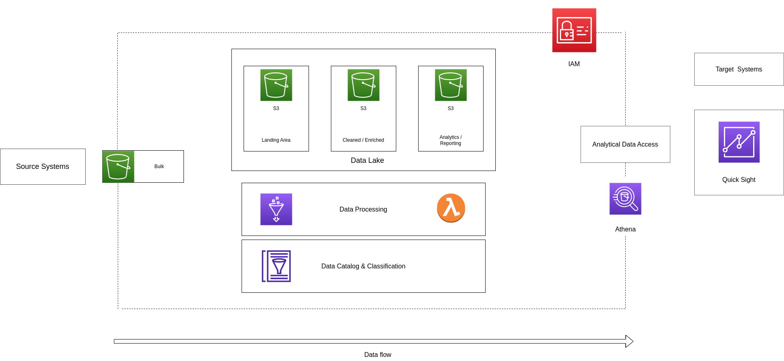
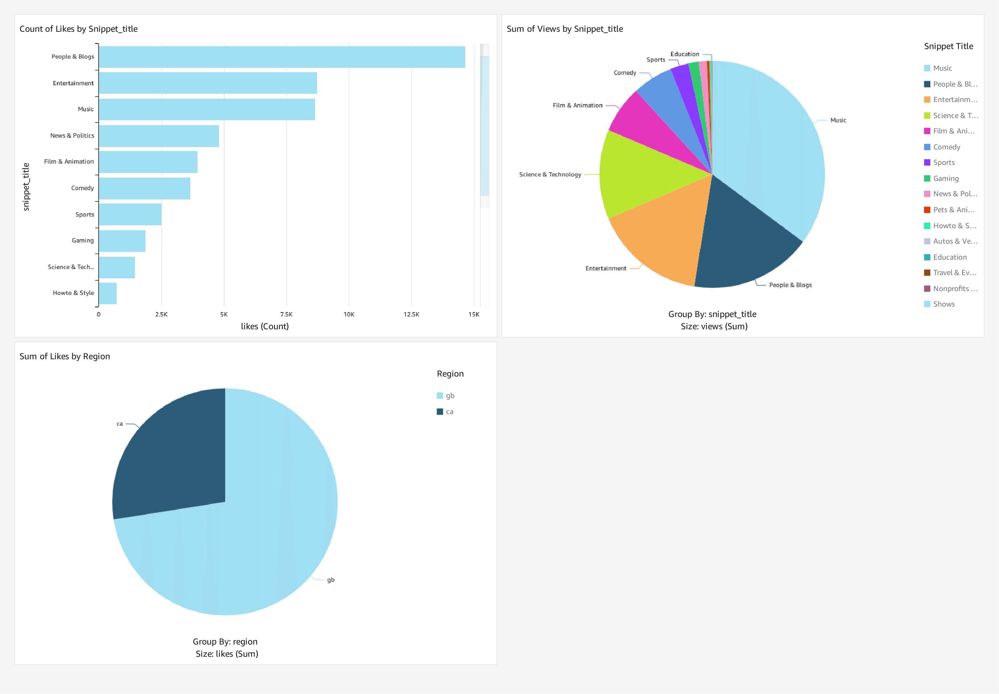

# Youtube Data Analysis Project

In this project, we will create an end-to-end project to obtain analytics from a Trending Youtube Video dataset.

## Dataset

The dataset is obtained from Kaggle and contains statistics of daily popular Youtube videos. 

https://www.kaggle.com/datasets/datasnaek/youtube-new

## Architecture




Project architecture used:

1. Amazon S3
2. AWS IAM
3. QuickSight
4. AWS Glue
5. Amazon Athena
6. AWS Lambda

## 1. Create S3 Bucket and upload the data

    1. Download from Kaggle the dataset
    2. Create an S3 Bucket(This could be through the CLI or in the Web Console) 
    3. Upload the data to our Bucket(This could be through the CLI or in the Web Console)

```
CLI commands for step 3: 

cd to the location of the files and execute the next commands
    
# To copy all JSON Reference data to the same location:

aws s3 cp . s3://bucket_name/youtube/raw_statistics_reference_data/ --recursive --exclude "*" --include "*.json"

# To copy all data files to their location, following Hive-style patterns:

aws s3 cp CAvideos.csv s3://bucket_name/youtube/raw_statistics/region=ca/
aws s3 cp DEvideos.csv s3://bucket_name/youtube/raw_statistics/region=de/
aws s3 cp FRvideos.csv s3://bucket_name/youtube/raw_statistics/region=fr/
aws s3 cp GBvideos.csv s3://bucket_name/youtube/raw_statistics/region=gb/
aws s3 cp INvideos.csv s3://bucket_name/youtube/raw_statistics/region=in/
aws s3 cp JPvideos.csv s3://bucket_name/youtube/raw_statistics/region=jp/
aws s3 cp KRvideos.csv s3://bucket_name/youtube/raw_statistics/region=kr/
aws s3 cp MXvideos.csv s3://bucket_name/youtube/raw_statistics/region=mx/
aws s3 cp RUvideos.csv s3://bucket_name/youtube/raw_statistics/region=ru/
aws s3 cp USvideos.csv s3://bucket_name/youtube/raw_statistics/region=us/
```

## 2. Create the roles for the services
1. Role for S3 and Glue

* Go to IAM, in the Role section, create a role and select Glue in Use cases for other AWS services, then add the next policies:

```
AWSGlueServiceRole 
AmazonS3FullAccess
```

2. Role for S3 and Lambda

* Go to IAM, in the Role section, create a role and select Lambda in Use cases for other AWS services, then add the next policies:

```
AWSGlueServiceRole 
AmazonS3FullAccess
```
    
    


## 3. Create Glue Crawler and Glue Catalog
    
1. Create a Glue Crawler through the Console
* The data source for this Crawler is the S3 bucket that we created, using this path : ```bucket_name/youtube/raw_statistics_reference_data```
* Use the role that we created before for Glue
* For the output add a new database for the raw data
* Run the Crawler, which will add a new table with the data of our JSON files

## 4. Using Athena to see the data on our new table

Go to Athena, configure the output bucket, and try to execute a SQL sentence to see the data of our table in the database of glue, Athena will show you the next error:

```
The row is not a valid JSON Object - JSONException: A JSONObject text must end with '}' at 2 [character 3 line 1]

``` 
Athena can't understand the array of the last column 'items', in that column is stored the data that we want, so we need to do preprocessing to obtain the data

    
## 5. ETL job in Lambda and cleaning the JSON data

* Go to Lambda and create a function, choose Python 3.10, use the role that we created before for Lambda
* The code of the file 'lambda_etl.py' access to the S3 storage, use pandas to extract the 'items' and then write the data in Parquet format in an S3 bucket
 Note: You need to set the environment variables to execute the lambda function, also you need to create a new bucket for the output
 Note: configure the test event with the name of the source bucket and key (the path of the file)

* Once you execute the function, you will obtain in the output bucket the parquet file, and a new table in the database that you use as a database output in the environment variables, that table now has the items ready to consult on Athena

## 6. Build another Crawler for the raw CSV data 

1. Create a Glue Crawler through the Console
* The data source for this Crawler is the S3 bucket that we created, using this path : ```bucket_name/youtube/raw_statistics```
* Use the role that we created before for Glue
* For the output use the database that you use for the raw JSON data
* Run the Crawler, which will add a new table with the data of our CSV files

## 7. Join the two tables on Athena (raw_statistics_reference_data, raw_statistics)

Go to Athena and make a SQL sentence joining the tables raw_statistics_reference_data, and raw_statistics to obtain some data as the following example: 

```

SELECT a.title, a.category_id, b.snippet_title  FROM "de-youtube-raw"."raw_statistics" a
INNER JOIN "db_youtube_cleaned"."cleaned_statistics_reference_data" b ON a.category_id = cast(b.id as int)
WHERE a.region = 'ca';

```
As you can see in the SQL Sentence, we need to cast the value to run the script, instead of that we will pre-process the data to change the type of data of the cleaned_statistics_reference_data table

go to the glue console, in the Tables section choose the table cleaned_statistics_reference_data, go to actions and click on change the schema, select the id column, and change it to bigint

if we try to run the script without the cast at this moment, we will get an error because the parquet file has his own schema for every 89column, when we change the type in the data catalog in glue, it doesn't change the type in the parquet file, to fix this we keep the changes.


## 8. Changing the data type of the parquet file

Steps


1. Keep the data type change in the data catalog

    This step is already done

2. Delete our testing JSON file

    For this, we need to go to the S3 bucket of the cleaned data and delete the JSON file pre-processed (parquet file) 

3. Confirm APPEND in Lambda

    Configure the test event as an S3 put and provide all the data of the S3 bucket to run the test event

4. Run Test event in Lambda

    Now we obtain again the parquet file and if we go to Athena and check the type of the column in the table, its bigint, now we can run the SQL script without the cast operation


## 9. Creating an ETL job in Glue to Process the raw_statistics data

1. Go to Glue and create a new ETL job (Visual with a source and target), in job details give it a name, and choose the role that we make for s3 and glue previously, enable the job bookmark, and don't change nothing else

2. In the visual section, click on Source and select AWS Glue Data Catalog, choose the database, and the table, in this case, de-youtube-raw database and raw_statistics

3. Click on Action and choose Change Schema, change all the long types of the columns for bigint

4. Click on Target and choose S3 Bucket, set the format as parquet, and configure the target location as the S3 bucket that we created for the cleaned data like the following example: 

```
s3://youtube-data-analisis-project-cleansed-data/youtube/raw_statistics/
```
In the partition section, we choose the 'region' column

6. If we try to run this job, we will see an error, the task fails because we have different languages in our data, its no easy for our programming language to understand the different encodings formats, to solve this, we will filter the data that we don't want with something called push_down_predicate

7. We have been working on the visual tool of glue, to use the push_down_predicate function, we need to go to the Script section and declare a variable called my_partition_predicate, the value of that variable is the regions that we want to clean avoiding another languages different to English, as the following example: 
```
my_partition_predicate = "region in ('ca','gb')"
```
we will use this variable in the next part of the code: 
```
# Script generated for node AWS Glue Data Catalog
AWSGlueDataCatalog_node1687231026330 = glueContext.create_dynamic_frame.from_catalog(
    database="de-youtube-raw",
    table_name="raw_statistics",
    transformation_ctx="AWSGlueDataCatalog_node1687231026330",
)
```
 in this part of the code, we need to add the parameter push_down_predicate and use the my_partition_predicate variable as a value, like the following example: 

```
 AWSGlueDataCatalog_node1687231026330 = glueContext.create_dynamic_frame.from_catalog(
    database="de-youtube-raw",
    table_name="raw_statistics",
    transformation_ctx="AWSGlueDataCatalog_node1687231026330",
    push_down_predicate = my_partition_predicate
)
```

Now we need to run the job to test if works or not, check if the data exist on your target bucket


## 10. Create another Crawler for the output data of the last step (preprocessed raw_statistics data)

1. Create a Glue Crawler through the Console
* The data source for this Crawler is the S3 bucket of cleaned data, using this path : ```bucket_name/youtube/raw_statistics```
* Use the role that we created before for Glue
* For the output use the database of cleaned data
* Run the Crawler, which will add a new table with the data of our parquet files


## 9. Add the S3 trigger to Lambda

We want to create a mechanism that whenever any file gets uploaded in our raw_statistics_reference_data folder, run the lambda function and add the new data into the output bucket, that's why we will create a trigger into our lambda function

1. Go to lambda and select the function from step 5, in his configuration, add a trigger

Trigger configuration:

Event types = All object create events
prefix = youtube/raw_statistics_reference_data/
suffix = .json

2. We need to test the trigger, so, go to the S3 bucket of raw data and delete all the raw_statistics_reference_data files, also we need to delete the output file in the bucket of cleaned data

3. Upload again the data like in step 1, the lambda function will be activated automatically and we will have the multiple preprocessed files available on the output bucket

4. Now we have both json and CSV files converted as parquet files 

## 10. Building the ETL pipeline

1. Go to Glue and create a new ETL job (Visual with a source and target), in job details give it a name, and choose the role that we make for s3 and glue previously, enable the job bookmark, and don't change nothing else

2. In the visual section, click on Source and select AWS Glue Data Catalog, choose the database, and the table, in this case, de-youtube-cleaned database and raw_statistics table

3.  Click again on Source and select AWS Glue Data Catalog, choose the database, and the table, in this case, de-youtube-cleaned database and raw_statistics_reference_data table

4. Click on Action and choose Join, in node parents click on both glue catalog sources, select Inner Join in the join type section, and finally in join conditions select category_id in the first field, and id in the second 

5. Create a new bucket for the output data

6. Click on target and select S3 bucket, a parent with the join, select the format as parquet, select the compression type as snappy, and the target location as the bucket that you previously created for the new data, in the data catalog update options select 'Create a table in the Data Catalog and on subsequent runs, update the schema and add new partitions', on the database we need to create a new one, so go to Athena and run the following script:

```
CREATE DATABASE db_youtube_analytics;

```
once created, select it on the database configuration of the data target of the glue ETL, enter a name for the table name, in my case, I selected final_analytics, and finally, in partition configuration, we add two y partition keys, by region and category_id

7. Run the job, wait, and check out the output bucket for the new partitioned data

## 11. Build a reporting version

1. Go to QuickSight, in the Dataset section and create a new one, select Athena as the data source, give it a name, validate the connection and create the data source, select your db_youtube_analytics database, click final_analytics table, see the preview and save it

2. Go to the dataset section and click on the new one and then click on Create Analysis, now you can start building your dashboard


